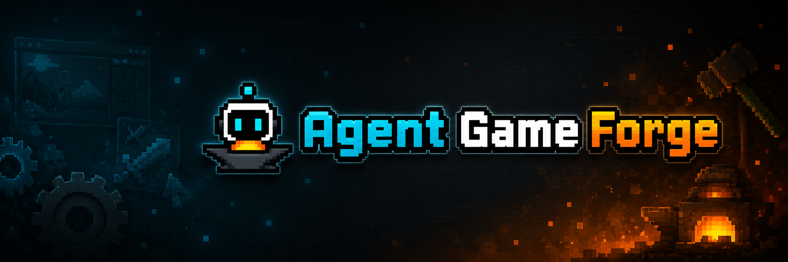

<p align="center">
  
</p>

<p align="center">
  <b>L'IDE de jeux 2D local-first et bring-your-own-agent.</b><br/>
  Codex ou Claude Code pilote. Vous livrez du JS navigateur vanilla.
</p>

<p align="center">
  <a href="./README.md">English</a> ·
  <a href="./README.es.md">Español</a> ·
  <a href="./README.pt-BR.md">Português (Brasil)</a> ·
  <a href="./README.de.md">Deutsch</a> ·
  <b>Français</b> ·
  <a href="./README.zh-CN.md">简体中文</a> ·
  <a href="./README.zh-TW.md">繁體中文</a> ·
  <a href="./README.ko.md">한국어</a> ·
  <a href="./README.ja.md">日本語</a> ·
  <a href="./README.ar.md">العربية</a> ·
  <a href="./README.ru.md">Русский</a> ·
  <a href="./README.uk.md">Українська</a> ·
  <a href="./README.tr.md">Türkçe</a>
</p>

<p align="center">
  <a href="https://github.com/0x0funky/agent-game-forge/stargazers"></a>
  
  
  
</p>

---

Agent Game Forge (**AGF**) est un IDE de bureau open source qui permet à un agent de codage IA de construire pour vous des jeux 2D complets — sprites, arrière-plans parallax, physique, dangers, objets à ramasser, agencements de scènes — et qui vous offre un éditeur visuel pour ajuster par glisser-déposer tout ce que l'agent n'a pas réussi. **Vous choisissez l'agent** (Codex CLI ou Claude Code), **vous choisissez le modèle d'image** (Gemini 2.5 Flash Image ou OpenAI gpt-image-1), et le jeu produit est du JS + Canvas pur — fonctionne dans n'importe quel navigateur, sans verrouillage à un framework.

---

## ✨ En un coup d'œil

- 🤖 **Bring your own agent** — Codex CLI ou Claude Code. Changez dans Settings. En direct.
- 🎨 **Pipeline d'assets de niveau production** — chroma-key de sprite sheets, animation multi-actions, parallax 4 couches tileable + despill — tout est de première classe, pas rajouté après coup.
- 🖼️ **Génération d'images multi-fournisseurs** — Gemini 2.5 Flash Image (bon marché, multimodal natif) ou OpenAI gpt-image-1 (premium). Vous fournissez la clé API ; elle reste sur votre machine.
- 🧱 **Éditeur visuel de scènes** — glissez plateformes, dangers, objets, colliders ; superposition des hitbox ; rechargement à chaud dans l'onglet Play.
- 📦 **Runtime Vanilla JS + Canvas** — les jeux générés n'ont aucune dépendance à un framework. Poussez le dossier sur GitHub Pages et ça tourne, tout simplement.
- 💻 **Local-first, open source** — daemon + UI web sur `localhost` ; les fichiers de votre projet restent sur votre disque ; intention de type MIT.
- 💰 **Coûts transparents** — le panneau Settings affiche le nombre d'appels d'image-gen du jour et la dépense estimée en $ par fournisseur.

---

## 🎬 Démo

> Bientôt : une vidéo démo de 90 secondes montrant prompt → platformer jouable → édition en direct → changement de CLI.

**Hero shot** (la fenêtre AGF) :

> _Insérer la capture hero une fois disponible_

**Settings — preuve du BYOA** :

> _Insérer la capture du modal Settings montrant agent picker + API keys + image-gen defaults_

**Éditeur de scènes — glissez un danger, voyez-le dans Play** :

> _Insérer un GIF court_

---

## 🚀 Démarrage rapide

**Prérequis** : Node ≥ 20, npm ≥ 10, et **au moins un** de :

- [Codex CLI](https://github.com/openai/codex) — `npm i -g @openai/codex`
- [Claude Code](https://github.com/anthropics/claude-code) — `npm i -g @anthropic-ai/claude-code`

```bash
git clone https://github.com/0x0funky/agent-game-forge.git
cd agent-game-forge
npm install
npm run dev
```

Cela lance :

- **Daemon** sur <http://localhost:7621>
- **Web UI** sur <http://localhost:7620>

Ouvrez l'URL web. Cliquez sur l'icône engrenage (en haut à droite) → **Settings** :

1. **Agent CLI** — choisissez Codex ou Claude Code (celui que vous avez installé).
2. **API keys** (nécessaires uniquement pour la voie Claude Code) — collez votre clé Gemini ou OpenAI. Le daemon les écrit dans `~/.ogf/secrets.json` (mode 600). Les variables d'environnement (`OPENAI_API_KEY`, `GEMINI_API_KEY`) prennent le pas sur le fichier.
3. **Image-gen defaults** — choisissez fournisseur + modèle préférés.

Fermez Settings. Ouvrez un dossier de projet. Tapez un prompt comme :

> *« Plateformer à défilement latéral sur un chien qui rentre à la maison, avec des niveaux de toits et de portail de parc. »*

Envoyez. Regardez l'agent le construire. Appuyez sur **Play** quand il s'arrête.

---

## 🧭 Comment ça marche

```
        ┌──────────────┐    ┌──────────────────────────┐    ┌─────────────┐
Vous ─→ │  Web UI      │ ←→ │  Daemon (Node + SQLite)  │ ←→ │  Agent CLI  │
        │  React canvas│    │  /api/runs, /api/scenes  │    │  (Codex /   │
        │  Scene editor│    │  /api/gen-image (routed) │    │   Claude    │
        └──────────────┘    └──────────────┬───────────┘    │   Code)     │
                                           │                 └─────┬───────┘
                                           ↓                       │
                                    ┌──────┴──────┐                │
                                    │ Gemini /    │ ←──────────────┘
                                    │ OpenAI API  │   (gen-image via
                                    │ (votre key) │    daemon HTTP)
                                    └─────────────┘
```

**1. Vous parlez à l'agent dans le chat.** L'UI web fait du streaming de la conversation ; SSE relaie chaque token + appel d'outil.

**2. L'agent lit les conventions et skills d'AGF.** Chaque projet est livré avec `.ogf/conventions/` (règles universelles + par genre) et `.agents/skills/` (procédures de génération de sprite + map) en vendored. L'agent suit les recipes — il ne réinvente pas la pipeline.

**3. Pour les images, l'agent appelle le `/api/gen-image` du daemon** (via `python .agents/tools/gen-image.py` ou `curl` direct). Le daemon route vers Gemini ou OpenAI en utilisant votre clé API enregistrée. Les utilisateurs de Codex avec l'outil `image_gen` intégré peuvent l'utiliser à la place — les deux voies produisent des PNG équivalents.

**4. L'éditeur de scènes lit + écrit les mêmes fichiers JSON** que l'agent crée. Glissez une plateforme ; l'éditeur commit un patch JSON. Rafraîchissez la vue de l'agent ; il voit la mise à jour.

**5. Le runtime est le projet lui-même.** Les jeux générés sont du JS + Canvas pur — `index.html`, `src/*.js`, `data/*.json`, `assets/`. Poussez le dossier sur GitHub Pages. Terminé.

---

## 📂 Structure du dépôt

```
open-game-forge/
├── packages/
│   └── contracts/      # types TypeScript partagés : API, events, SceneModel
├── apps/
│   ├── daemon/         # daemon Node.js + Express (port 7621)
│   │   └── src/
│   │       ├── server.ts            # HTTP routes
│   │       ├── codex.ts             # Codex CLI adapter (spawn + stream-json)
│   │       ├── claude-code.ts       # Claude Code adapter (même pattern)
│   │       ├── agents.ts            # AgentAdapter dispatcher
│   │       ├── gen-image.ts         # Gemini + OpenAI router
│   │       ├── secrets.ts           # stockage ~/.ogf/secrets.json
│   │       ├── prefs.ts             # stockage ~/.ogf/preferences.json
│   │       ├── web-scene.ts         # loader JSON level → SceneModel
│   │       ├── scenes.ts            # SceneOp applier (move/scale/add/remove)
│   │       └── templates/           # skills / conventions / recipes vendored
│   └── web/            # UI Vite + React (port 7620)
│       └── src/
│           ├── App.tsx
│           ├── components/
│           │   ├── SceneEditor.tsx  # éditeur de scènes basé sur Canvas
│           │   ├── SettingsModal.tsx
│           │   └── PlayPane.tsx
│           └── lib/api.ts
└── docs/
    ├── architecture.md
    ├── roadmap.md
    └── genre-support.md
```

---

## 🛠️ Compiler depuis les sources

```bash
npm install           # installation du workspace
npm run build         # build contracts → daemon → web
npm run dev           # mode watch pour les trois (daemon hot-reload via tsx)
```

Commandes utiles :

- `npm -w @ogf/daemon run dev` — daemon seul, avec `tsx watch`
- `npm -w @ogf/web run dev` — serveur dev Vite
- `npm -w @ogf/contracts run build` — type-check du paquet contracts

---

## 📋 État du projet

| Genre | État | Notes |
|---|---|---|
| **Plateformer à défilement latéral** | ✅ livré | Pipeline parallax, dangers, objets, ennemis, multi-niveaux, chroma-key de sprites |
| RPG vue de dessus | 🟡 partiel | Foundation seed + recipes ; certaines recipes encore en maturation |
| Tower defense / arena | 🟡 partiel | Hérité de branches antérieures ; nécessite du polish |
| Roguelike / Metroidvania | 🚧 planifié | Après le launch |

**Moteurs** : Web (vanilla JS + Canvas) est la cible par défaut et activement développée. Godot 4 fonctionne encore pour les projets legacy ; aucune nouvelle fonctionnalité Godot ajoutée.

---

## 📚 Documentation

- [`docs/architecture.md`](docs/architecture.md) — principes de conception, paradigme agent-first
- [`docs/roadmap.md`](docs/roadmap.md) — plan par phases
- [`docs/genre-support.md`](docs/genre-support.md) — matrice des genres
- Fichiers de convention (vendored par projet) — [`apps/daemon/src/templates/conventions/`](apps/daemon/src/templates/conventions)
- Recipes (vendored par projet) — [`apps/daemon/src/templates/recipes/`](apps/daemon/src/templates/recipes)

---

## 🤝 Contribuer

Nous sommes en pre-launch. Le codebase est suffisamment petit pour que les PR soient les bienvenues, mais merci d'ouvrir une issue d'abord pour discuter du scope. Meilleures façons d'aider en ce moment :

- **Essayez-le et signalez les bugs** — ouvrez une issue avec le log du daemon (`~/.ogf/claude-code-debug.jsonl` ou votre terminal où tourne `npm run dev`)
- **Construisez un jeu** et montrez-le — ravis de le mettre en avant dans le README
- **Testez sur macOS / Linux** — le dev principal est sur Windows ; des problèmes multi-plateformes traînent probablement

---

## 🔐 Sécurité & données

- **Votre code reste sur votre machine.** AGF est local-first. Le daemon se lie à `127.0.0.1` ; rien ne sort de votre machine sauf les appels au fournisseur d'IA que vous avez choisi.
- **Les clés API** sont stockées dans `~/.ogf/secrets.json` avec file mode 600 (propriétaire uniquement). Elles n'entrent jamais dans git, n'apparaissent jamais dans les logs d'AGF.
- **Les conversations** sont stockées dans `~/.ogf/ogf.db` (SQLite). Supprimez le fichier pour réinitialiser.

---

## 📜 Licence

Licence en attente — elle sera open-source-friendly (MIT ou Apache-2.0) au launch. Le code source est public ; merci de ne pas redistribuer de forks commerciaux avant que la licence ne soit fixée.

---

## 🙏 Crédits

- Pattern daemon-and-spawn adapté de [`nexu-io/open-design`](https://github.com/nexu-io/open-design)
- Pipeline de génération de sprites adapté de [`0x0funky/agent-sprite-forge`](https://github.com/0x0funky/agent-sprite-forge)
- Construit avec Codex CLI + Claude Code — oui, ce projet est en grande partie écrit par les mêmes agents qu'il pilote

---

<p align="center">
  Fait pour les indie game devs qui aiment shipper.<br/>
  <a href="https://github.com/0x0funky/agent-game-forge/issues">Signaler un bug</a> ·
  <a href="https://github.com/0x0funky/agent-game-forge/discussions">Discussions</a>
</p>
